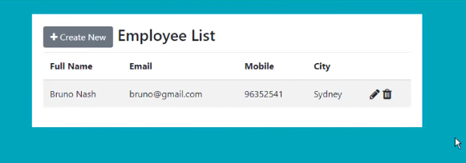
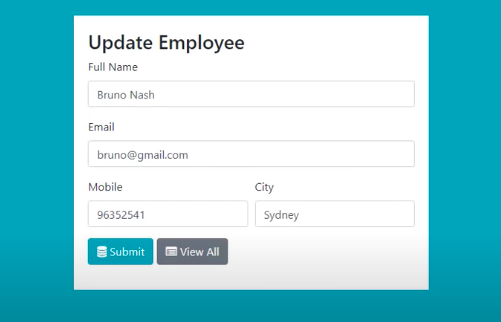
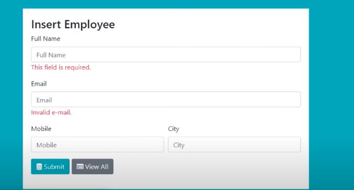
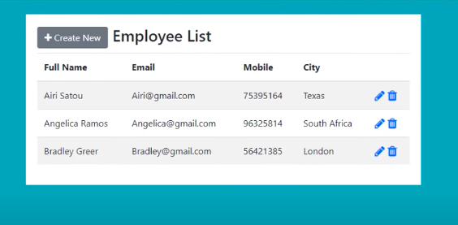

# CRUD-Database
CRUD Database implemented using Node.js express and MongoDB

Before Running this Project
Install npm packages using 'npm install' command.

Content discussed :

1) Form Design  
2) Post Form Data into Node.js  
3) Implemented Form Validation with mongoose model  
4) Insert, Update and Delete with Node and MongoDB  
5) Use of Handlebars  
6) Use of Mongoose  

